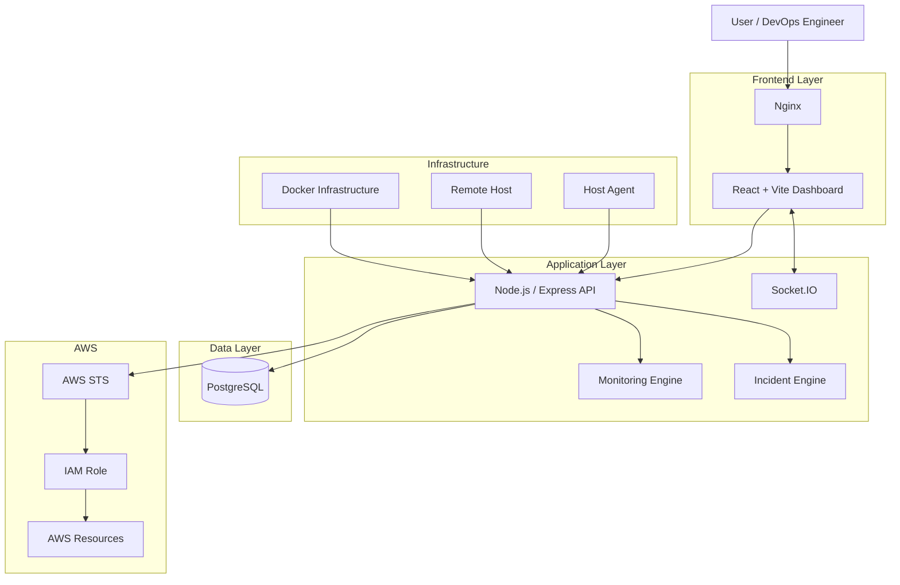
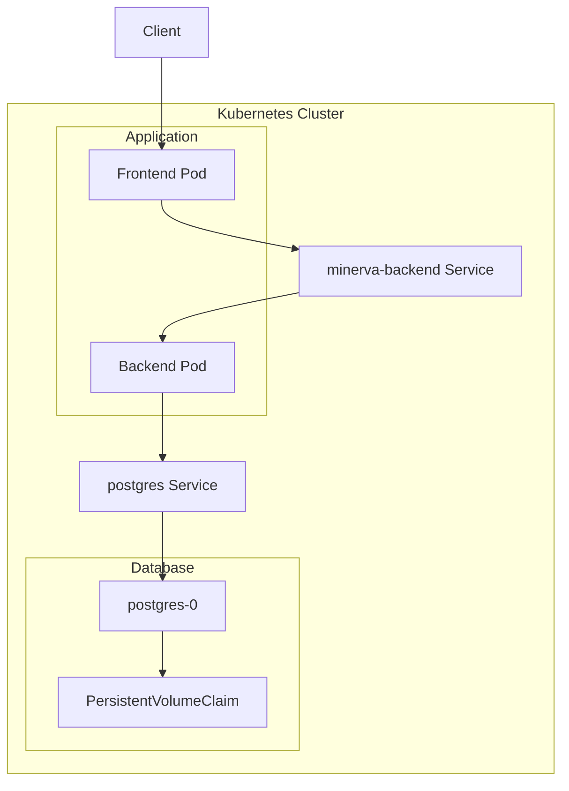
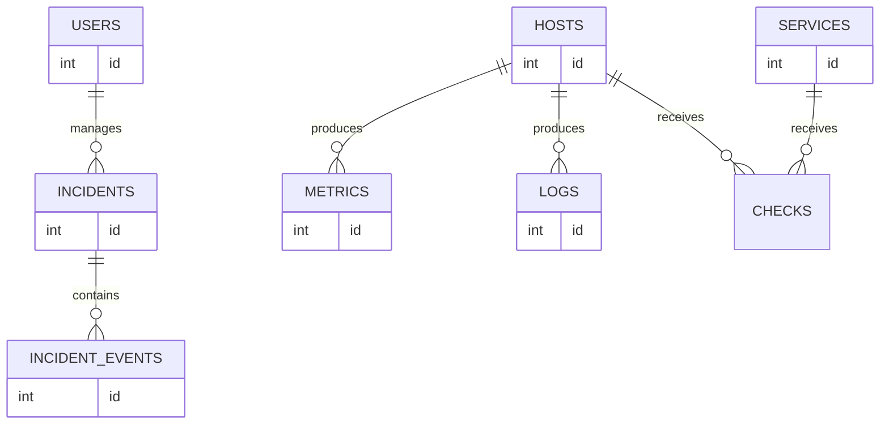

# Minerva Sentinel

> **Hybrid Cloud Infrastructure Monitoring, Observability & Incident Management Platform**

Minerva Sentinel is a full-stack cloud and infrastructure monitoring platform designed to provide centralized visibility into hosts, services, containers, cloud resources, logs, metrics, incidents, and operational health.

It was built as a practical Cloud/DevOps engineering project to demonstrate modern infrastructure monitoring, containerization, cloud integration, secure service connectivity, database management, CI/CD practices, and Kubernetes deployment patterns.

The platform combines a React-based operations dashboard, Node.js backend services, PostgreSQL persistence, host monitoring agents, AWS integrations, Docker container monitoring, real-time communication, alerting, and Kubernetes-based deployment.

---

## Project Overview

Modern infrastructure often spans multiple environments:

- Virtual machines
- Cloud providers
- Containers
- Databases
- Kubernetes clusters
- Local servers
- Remote hosts
- Application services

Monitoring these systems independently makes infrastructure operations fragmented and difficult to manage.

**Minerva Sentinel provides a centralized control and observability layer for infrastructure operations.**

The platform is designed to answer questions such as:

- Are my servers online?
- Which hosts are consuming excessive CPU or memory?
- Which application services are unhealthy?
- Are containers running correctly?
- What infrastructure incidents are currently active?
- What happened before an incident occurred?
- Which AWS account is connected?
- Are cloud resources accessible securely?
- Can infrastructure events be acknowledged and resolved?
- Is the monitoring backend itself healthy?
- Is the database reachable?
- What operational events are occurring in real time?

---

# Core Capabilities

## Infrastructure Monitoring

Minerva Sentinel collects and displays system-level telemetry from connected hosts.

Metrics include:

- CPU utilization
- Memory utilization
- Disk utilization
- Host availability
- Host heartbeat
- Service health
- Infrastructure status

The monitoring system continuously evaluates host health and makes telemetry available through the Minerva dashboard.

---

## Host Connection Management

Remote hosts can be connected to Minerva Sentinel using generated connection credentials.

The connection workflow supports:

- Creating host connections
- Generating one-time connection keys
- Copyable installation/connection commands
- Registering remote monitoring agents
- Viewing active connections
- Disconnecting hosts
- Removing host connections

This provides a scalable foundation for monitoring infrastructure beyond the machine hosting the Minerva backend.

---

## Incident Management

Minerva Sentinel includes an incident-management workflow for tracking infrastructure failures.

Supported incident actions include:

- Incident detection
- Incident acknowledgement
- Incident resolution
- Bulk acknowledgement
- Root-cause tracking
- Remediation tracking
- Incident comments

Incident lifecycle events are stored separately to provide a historical timeline of operational activity.

### Incident Timeline Event Types

```text
DETECTED
ACKNOWLEDGED
RESOLVED
ROOT_CAUSE
REMEDIATION
COMMENT
```

This makes it possible to reconstruct the sequence of events surrounding an infrastructure incident.

---

## Alert Policies

Minerva Sentinel supports infrastructure alert policies covering areas such as:

- Host resource utilization
- Host heartbeat
- Service health

Current monitoring logic includes configurable operational thresholds such as:

```text
Resource warning threshold: 95%
Host offline threshold:      30 seconds
```

These policies provide the foundation for automated incident creation and infrastructure alerting.

---

# Docker & Container Monitoring

Minerva Sentinel includes container-focused monitoring capabilities.

The platform contains functionality for:

- Docker connection management
- Container visibility
- Docker snapshots
- Container state information
- Infrastructure/container correlation

Docker-related information is persisted through dedicated database entities including:

```text
docker_connections
docker_snapshots
```

The Kubernetes version of the architecture intentionally avoids mounting:

```text
/var/run/docker.sock
```

inside the main backend container.

This separates application privileges from infrastructure monitoring privileges and reduces the security risk of giving the API unrestricted access to the container runtime.

Container/node monitoring is intended to be handled by dedicated monitoring agents.

---

# AWS Integration

Minerva Sentinel supports secure AWS account integration.

Instead of storing long-lived AWS access keys, the platform uses:

- IAM Role ARN
- External ID
- AWS STS
- `AssumeRole`
- `GetCallerIdentity`

This approach allows Minerva Sentinel to establish temporary AWS sessions without permanently storing AWS access keys.

### AWS Connection States

AWS integrations can move through states such as:

```text
PENDING
CONNECTED
ERROR
DISCONNECTED
```

Connections can also be:

- Verified
- Disconnected
- Deleted

The AWS integration architecture follows the principle of using temporary credentials wherever possible.

---

# Observability

Minerva Sentinel contains an observability-focused architecture designed around:

- Infrastructure metrics
- Application logs
- Health endpoints
- Host monitoring
- OpenTelemetry instrumentation
- Central logging
- Real-time events

The backend currently includes AWS Distro for OpenTelemetry automatic instrumentation.

The architecture is designed to support future integration with components such as:

- OpenTelemetry Collector
- Prometheus
- Grafana
- Distributed tracing backends

---

# Real-Time Communication

The backend uses **Socket.IO** to provide real-time communication between infrastructure events and connected clients.

Potential real-time events include:

- Host status changes
- Infrastructure metrics
- Incident updates
- Alerts
- Monitoring events

This allows Minerva Sentinel to behave more like an operations console than a traditional request/response dashboard.

---

# Application Health

Minerva Sentinel separates application liveness from database readiness.

## Liveness

```http
GET /api/health
```

This endpoint verifies that the Node.js HTTP application is running.

Example response:

```json
{
  "success": true,
  "message": "Minerva Sentinel API",
  "timestamp": "2026-09-26T20:56:10.653Z"
}
```

---

## Readiness

```http
GET /api/ready
```

The readiness endpoint verifies that:

1. The backend is running.
2. PostgreSQL is reachable.

Example:

```json
{
  "success": true,
  "message": "Minerva Sentinel API is ready",
  "timestamp": "2026-09-26T20:56:10.690Z"
}
```

This separation enables proper Kubernetes:

- `startupProbe`
- `livenessProbe`
- `readinessProbe`

behavior.

---

# Technology Stack

## Frontend

- React
- Vite
- Tailwind CSS
- React Router
- Chart.js
- Socket.IO Client
- Nginx

---

## Backend

- Node.js
- Express.js
- Socket.IO
- PostgreSQL client
- AWS SDK
- AWS STS
- OpenTelemetry
- REST APIs

---

## Database

- PostgreSQL 17
- SQL migrations
- Persistent storage
- Stateful workloads

---

## Cloud

- Amazon Web Services
- IAM
- STS
- EC2
- RDS
- ECR
- VPC
- CloudFront
- S3

AWS support inside Minerva Sentinel is implemented using temporary role-based access rather than static AWS access-key storage.

---

## Containers

- Docker
- Docker Compose
- Multi-container architecture
- Container image builds
- Local container registry/runtime workflows

---

## Kubernetes

- Kubernetes
- Minikube
- kubectl
- Kustomize
- Deployments
- StatefulSets
- Services
- ConfigMaps
- Secrets
- PersistentVolumeClaims
- Jobs
- Health probes
- Resource requests and limits
- Pod security controls

---

# System Architecture



---

# Kubernetes Architecture

Minerva Sentinel is also being implemented using a Kubernetes-native architecture.



---

# Kubernetes Deployment Status

The local Kubernetes implementation currently includes:

| Component | Status |
|---|---|
| Minikube cluster | ✅ |
| `minerva` namespace | ✅ |
| PostgreSQL StatefulSet | ✅ |
| PostgreSQL ClusterIP Service | ✅ |
| PostgreSQL Headless Service | ✅ |
| PersistentVolumeClaim | ✅ |
| Database bootstrap Job | ✅ |
| Backend Deployment | ✅ |
| Backend ClusterIP Service | ✅ |
| Startup probe | ✅ |
| Liveness probe | ✅ |
| Database-aware readiness probe | ✅ |
| ConfigMaps | ✅ |
| Kubernetes Secrets | ✅ |
| Resource limits | ✅ |
| Non-root backend container | ✅ |
| ServiceAccount token disabled | ✅ |
| Frontend Kubernetes Deployment | 🚧 |
| Kubernetes Ingress | 🚧 |
| Monitoring agent DaemonSet | 🚧 |

> The Kubernetes implementation is under active development. Completed components are validated locally using Minikube.

---

# Kubernetes Security

The Kubernetes deployment includes several workload-hardening practices.

## Non-root containers

Backend workloads run without root privileges.

```yaml
securityContext:
  runAsNonRoot: true
  runAsUser: 1000
  runAsGroup: 1000
  allowPrivilegeEscalation: false
```

---

## Linux Capabilities

Unnecessary Linux capabilities are removed:

```yaml
capabilities:
  drop:
    - ALL
```

---

## Seccomp

Pods use:

```yaml
seccompProfile:
  type: RuntimeDefault
```

---

## Service Account Tokens

Workloads that do not require Kubernetes API access use:

```yaml
automountServiceAccountToken: false
```

This reduces unnecessary credential exposure inside containers.

---

# Kubernetes Resource Management

Backend workloads define requests and limits.

Example:

```yaml
resources:
  requests:
    cpu: 150m
    memory: 256Mi

  limits:
    cpu: 750m
    memory: 768Mi
```

PostgreSQL also has dedicated resource allocations.

This allows Kubernetes to make informed scheduling decisions while preventing individual workloads from consuming unlimited cluster resources.

---

# Persistent PostgreSQL Storage

PostgreSQL runs as a Kubernetes `StatefulSet`.

Persistent storage is provisioned using:

```text
PersistentVolumeClaim
```

Current local storage:

```text
5 GiB
ReadWriteOnce
StorageClass: standard
```

The database remains persistent even when the PostgreSQL Pod is recreated.

---

# Database Bootstrap

The database schema is initialized using a dedicated Kubernetes Job rather than coupling database initialization directly to application startup.

The bootstrap process:

1. Connects to PostgreSQL.
2. Loads database credentials securely.
3. Verifies that the target database is empty.
4. Executes the baseline schema.
5. Verifies the resulting schema.
6. Commits the transaction.
7. Exits after successful initialization.

Current schema contains **13 application tables**:

```text
alerts
aws_connections
checks
docker_connections
docker_snapshots
host_connections
hosts
incident_events
incidents
logs
metrics
services
users
```

The bootstrap operation is deliberately separated from normal application deployment.

---

# Database Architecture

Minerva Sentinel currently persists operational information across several PostgreSQL entities.



> This diagram represents the high-level operational relationship between core Minerva Sentinel entities and is not intended to reproduce every database column.

---

# Repository Structure

```text
minerva-sentinel/
│
├── frontend-v2/
│   ├── src/
│   ├── public/
│   ├── Dockerfile
│   ├── nginx.conf
│   └── package.json
│
├── backend/
│   ├── src/
│   │   ├── config/
│   │   ├── controllers/
│   │   ├── middleware/
│   │   ├── routes/
│   │   ├── services/
│   │   ├── app.js
│   │   └── bootstrap.js
│   │
│   ├── certs/
│   ├── Dockerfile
│   └── package.json
│
├── agent/
│
├── database/
│   ├── baseline/
│   └── migrator/
│
├── deploy/
│   └── kubernetes/
│       ├── base/
│       │   ├── postgres/
│       │   ├── backend/
│       │   ├── frontend/
│       │   └── database-bootstrap/
│       │
│       └── overlays/
│           └── local/
│
├── docker-compose.yml
├── .gitignore
└── README.md
```

---

# Dashboard Modules

The frontend includes operational sections for:

- Dashboard
- Infrastructure
- AWS Resources
- Containers
- Observability
- CI/CD
- Alerts
- Logs
- Security
- Storage
- Cost Explorer
- Settings

These modules provide the foundation for expanding Minerva Sentinel into a broader infrastructure operations platform.

---

# Running Minerva Sentinel with Docker

## Prerequisites

Install:

- Git
- Docker
- Docker Compose

Clone the repository:

```bash
git clone https://github.com/Semicrypt/minerva-sentinel.git
cd minerva-sentinel
```

Configure the required environment variables.

Example database variables:

```env
POSTGRES_USER=postgres
POSTGRES_PASSWORD=<secure-password>
POSTGRES_DB=hybrid_monitor
```

Backend configuration includes values such as:

```env
PORT=5000

DB_HOST=postgres
DB_PORT=5432
DB_NAME=hybrid_monitor
DB_USER=postgres
DB_PASSWORD=<secure-password>

JWT_SECRET=<secure-random-secret>

NODE_ENV=production
```

Never commit real secrets to Git.

Start the stack:

```bash
docker compose up -d --build
```

Check running containers:

```bash
docker compose ps
```

View backend logs:

```bash
docker compose logs -f backend
```

Stop the environment:

```bash
docker compose down
```

---

# Running Locally with Kubernetes

## Requirements

Install:

- Docker
- kubectl
- Minikube
- Kustomize support through kubectl

Start Minikube:

```bash
minikube start \
  --driver=docker \
  --cpus=4 \
  --memory=6144
```

Verify:

```bash
kubectl get nodes
```

Expected:

```text
minikube   Ready
```

---

## Build Local Images

Build the backend directly into Minikube:

```bash
minikube image build \
  -t minerva-backend:local \
  ./backend
```

Verify:

```bash
minikube image ls | grep minerva
```

---

## Deploy Kubernetes Resources

Render configuration:

```bash
kubectl kustomize \
  deploy/kubernetes/overlays/local \
  > /tmp/minerva-rendered.yaml
```

Perform a server-side validation:

```bash
kubectl apply \
  --dry-run=server \
  -f /tmp/minerva-rendered.yaml
```

Review changes:

```bash
kubectl diff -k \
  deploy/kubernetes/overlays/local
```

Apply:

```bash
kubectl apply -k \
  deploy/kubernetes/overlays/local
```

---

## Verify Deployment

```bash
kubectl get pods -n minerva
```

```bash
kubectl get deployments -n minerva
```

```bash
kubectl get statefulsets -n minerva
```

```bash
kubectl get svc -n minerva
```

```bash
kubectl get pvc -n minerva
```

---

## Verify Backend Rollout

```bash
kubectl rollout status \
  deployment/minerva-backend \
  -n minerva \
  --timeout=180s
```

---

## Check Backend Logs

```bash
kubectl logs \
  deployment/minerva-backend \
  -n minerva
```

A healthy startup includes PostgreSQL connectivity:

```text
Minerva Sentinel API
PostgreSQL Connected
Socket.IO Ready
Central logging enabled
```

---

# Kubernetes Internal API Test

Minerva Sentinel can be validated without exposing the backend publicly.

Create a temporary curl Pod:

```bash
kubectl run minerva-api-test \
  -n minerva \
  --image=curlimages/curl:latest \
  --restart=Never \
  --command -- \
  sh -c '
    echo "=== HEALTH ==="
    curl -fsS http://minerva-backend:5000/api/health
    echo
    echo "=== READY ==="
    curl -fsS http://minerva-backend:5000/api/ready
    echo
  '
```

Check output:

```bash
kubectl logs \
  -n minerva \
  minerva-api-test
```

Remove the temporary Pod:

```bash
kubectl delete pod \
  -n minerva \
  minerva-api-test
```

---

# Environment Configuration

Minerva Sentinel supports environment-based configuration.

Important backend variables include:

| Variable | Purpose |
|---|---|
| `NODE_ENV` | Application environment |
| `PORT` | Backend HTTP port |
| `DB_HOST` | PostgreSQL hostname |
| `DB_PORT` | PostgreSQL port |
| `DB_NAME` | Database name |
| `DB_USER` | Database username |
| `DB_PASSWORD` | Database password |
| `DB_SSL` | Enables database TLS |
| `DB_SSL_CA` | Optional CA bundle |
| `JWT_SECRET` | JWT signing secret |
| `DB_SECRET_ID` | Optional AWS Secrets Manager database secret |
| `APP_SECRET_ID` | Optional AWS application secret |
| `AWS_TRUST_PRINCIPAL_ARN` | AWS trust principal configuration |

---

# Cloud-Neutral Secret Handling

The backend supports two credential-loading strategies.

## Local / Kubernetes

Database credentials can be provided using environment variables or Kubernetes Secrets:

```text
DB_USER
DB_PASSWORD
JWT_SECRET
```

## AWS Environments

The backend can optionally retrieve secrets using:

```text
DB_SECRET_ID
APP_SECRET_ID
```

This allows the application to remain portable between local Kubernetes and AWS deployments.

---

# API Structure

Current API groups include:

```text
/api/auth
/api/services
/api/dashboard
/api/checks
/api/incidents
/api/alert-policies
/api/metrics
/api/hosts
/api/docker
/api/aws
/api/logs
```

Operational endpoints include:

```text
GET /api/health
GET /api/ready
```

---

# Security Design

Security is treated as an architectural concern rather than an afterthought.

Current controls include:

### AWS

- No permanent AWS access keys stored for account connections
- STS temporary credentials
- IAM Role assumption
- External ID support

### Kubernetes

- Non-root containers
- `allowPrivilegeEscalation: false`
- Linux capabilities dropped
- RuntimeDefault seccomp
- Service account tokens disabled where unnecessary
- Kubernetes Secrets for sensitive configuration
- Secrets excluded from Git
- ClusterIP services for internal workloads
- No Docker socket mounted into the backend

### Application

- JWT-based authentication
- Environment-based secret injection
- Centralized middleware
- Dedicated error middleware
- Database-aware readiness checks

---

# DevOps Practices Demonstrated

Minerva Sentinel demonstrates practical experience with:

- Linux administration
- Git
- GitHub
- Docker
- Docker Compose
- Container image design
- Kubernetes
- StatefulSets
- Deployments
- Services
- ConfigMaps
- Secrets
- Jobs
- Persistent storage
- Kustomize
- Health probes
- Resource management
- Workload security
- PostgreSQL
- AWS IAM
- AWS STS
- AWS RDS
- AWS EC2
- AWS ECR
- AWS VPC
- CI/CD workflows
- Infrastructure monitoring
- Logging
- Metrics
- Observability
- Incident management
- OpenTelemetry

---

# Engineering Decisions

## Why PostgreSQL runs as a StatefulSet

PostgreSQL requires stable storage and predictable state management.

A Kubernetes `StatefulSet` combined with a `PersistentVolumeClaim` provides persistence across Pod recreation.

---

## Why the backend uses a Deployment

The backend application is stateless from Kubernetes' perspective.

Application state is stored in PostgreSQL, allowing backend Pods to be recreated or horizontally scaled independently.

---

## Why readiness checks PostgreSQL

An HTTP server can technically be running while its database is unavailable.

Using a database-aware readiness endpoint prevents Kubernetes from routing traffic to an application instance that cannot perform database-backed operations.

---

## Why bootstrap is separate from application startup

Database schema initialization should not automatically execute every time an application Pod starts.

Using a dedicated Job provides controlled, auditable database initialization.

---

## Why Docker socket access is avoided

Mounting:

```text
/var/run/docker.sock
```

inside the backend effectively gives the application highly privileged control over the host container runtime.

Minerva Sentinel's Kubernetes architecture separates this responsibility from the main API workload.

---

## Why Kustomize is used

Kustomize allows a shared Kubernetes base to be combined with environment-specific configuration.

Example architecture:

```text
deploy/kubernetes/
├── base/
└── overlays/
    ├── local/
    ├── staging/
    └── production/
```

The current implementation contains the local environment and provides a foundation for additional deployment targets.

---

# Current Development Roadmap

## Completed

- [x] React dashboard foundation
- [x] Node.js/Express API
- [x] PostgreSQL data layer
- [x] JWT authentication
- [x] Host monitoring
- [x] Metrics collection
- [x] Logging
- [x] Incident management
- [x] Incident timelines
- [x] Alert policies
- [x] Host connection workflow
- [x] Docker monitoring foundation
- [x] AWS account connection workflow
- [x] STS role assumption
- [x] Docker Compose deployment
- [x] PostgreSQL Kubernetes StatefulSet
- [x] Persistent Kubernetes storage
- [x] Database bootstrap Job
- [x] Backend Kubernetes Deployment
- [x] Kubernetes health/readiness probes
- [x] Kubernetes workload hardening

## In Progress

- [ ] Frontend Kubernetes Deployment
- [ ] Frontend Kubernetes Service
- [ ] Kubernetes Ingress
- [ ] Dedicated monitoring agent DaemonSet
- [ ] OpenTelemetry Collector
- [ ] Prometheus integration
- [ ] Grafana dashboards

## Future Improvements

- [ ] Horizontal Pod Autoscaling
- [ ] NetworkPolicies
- [ ] PodDisruptionBudgets
- [ ] TLS-enabled Ingress
- [ ] Kubernetes-native metrics collection
- [ ] Multi-cluster monitoring
- [ ] Additional AWS resource discovery
- [ ] Azure integration
- [ ] Alert notification integrations
- [ ] Advanced RBAC
- [ ] Automated backup strategy
- [ ] GitOps deployment
- [ ] Production Helm chart

---

# CI/CD

Minerva Sentinel is designed to support automated container delivery workflows.

A typical deployment pipeline follows:

```text
Developer
    │
    ▼
Git Push
    │
    ▼
GitHub
    │
    ▼
CI Pipeline
    │
    ├── Install dependencies
    ├── Lint / validate
    ├── Build frontend
    ├── Build backend image
    ├── Container security checks
    └── Publish image
            │
            ▼
       Container Registry
            │
            ▼
       Deployment Target
```

Branches used during development have included feature-specific workflows for Docker deployment, container-registry pipelines, frontend work, and Kubernetes implementation.

---

# Production Evolution

The local environment is intentionally designed to map cleanly onto production architecture.

```text
Local Development             Production Evolution
──────────────────            ─────────────────────

Minikube                      Managed Kubernetes
Local PostgreSQL              Managed PostgreSQL / RDS
Local images                  Container registry
Kubernetes Secrets            External secret management
ClusterIP                     Ingress / Load Balancer
Local storage                 Production storage class
Single replica                Multi-replica deployment
Manual apply                  CI/CD or GitOps
```

---

# Troubleshooting

## Check Pods

```bash
kubectl get pods -n minerva
```

---

## Describe a Backend Pod

```bash
kubectl describe pod \
  -n minerva \
  -l app.kubernetes.io/component=backend
```

---

## Backend Logs

```bash
kubectl logs \
  -n minerva \
  deployment/minerva-backend
```

---

## PostgreSQL Logs

```bash
kubectl logs \
  -n minerva \
  postgres-0
```

---

## Verify PostgreSQL

```bash
kubectl exec \
  -n minerva \
  postgres-0 -- \
  sh -c 'pg_isready -U "$POSTGRES_USER" -d "$POSTGRES_DB"'
```

---

## Check Services

```bash
kubectl get svc -n minerva
```

---

## Check Storage

```bash
kubectl get pvc -n minerva
```

---

## Validate Kustomize

```bash
kubectl kustomize \
  deploy/kubernetes/overlays/local \
  > /tmp/minerva.yaml
```

---

## Server-Side Dry Run

```bash
kubectl apply \
  --dry-run=server \
  -f /tmp/minerva.yaml
```

---

## Review Infrastructure Changes

```bash
kubectl diff -k \
  deploy/kubernetes/overlays/local
```

---

# Lessons Demonstrated by the Project

Minerva Sentinel is not only an application project.

It demonstrates the operational lifecycle of a system:

```text
Design
  ↓
Develop
  ↓
Containerize
  ↓
Configure
  ↓
Persist
  ↓
Secure
  ↓
Deploy
  ↓
Observe
  ↓
Detect
  ↓
Respond
  ↓
Improve
```

The project focuses specifically on the boundary between **software engineering and infrastructure engineering**, which is where modern Cloud and DevOps engineering operates.

---

# Author

**Nwachukwu Ifeanyi Divine**

Cloud & DevOps Engineer

Areas of focus:

- AWS
- Azure
- Linux
- Docker
- Kubernetes
- Terraform
- CI/CD
- PostgreSQL
- Monitoring
- Observability
- Grafana
- Cloud Infrastructure

GitHub:

[github.com/Semicrypt](https://github.com/Semicrypt)

---

# Repository

```text
https://github.com/Semicrypt/minerva-sentinel
```

---

# Project Status

> **Active Development**

Minerva Sentinel is continuously evolving as a hands-on Cloud/DevOps engineering platform.

The project is being expanded from its Docker-based architecture into a Kubernetes-native deployment with stronger observability, security, automation, and infrastructure portability.

---

## License

This project is currently maintained as a personal engineering and portfolio project.

Unless a license is explicitly added to the repository, all rights remain with the project author.

---

<p align="center">
  <strong>Minerva Sentinel</strong><br>
  Hybrid Cloud Monitoring • Observability • Infrastructure Operations
</p>